# Learner Guide - Microsoft Azure AI Fundamentals (AI-900)

**Course Code:** TGS-2023021100  
**Version:** 1.0  
**Provider:** Tertiary Infotech Academy Pte Ltd

## Course Information

| Item | Details |
| --- | --- |
| Course Title | Microsoft Azure AI Fundamentals (AI-900) |
| Course Code | TGS-2023021100 |
| WSQ TSC | Artificial Intelligence Application (ICT-DIT-4016-1.1) |
| Duration | 2 Days (16 training hours) |
| Delivery Mode | Instructor-led with guided Azure AI lab activities |
| Course Repository | https://github.com/tertiarycourses/TGS-2023021100---Microsoft-Azure-AI-Fundamentals-AI-900- |

## Certification Status Note

Microsoft Learn states that Exam AI-900 was retired on June 30, 2026. These materials are therefore written as Azure AI Fundamentals courseware aligned to the AI-900 skills outline and Azure AI concepts.

## Course Goal

This course helps learners recognize common AI workloads, explain responsible AI considerations, and map business scenarios to Azure AI services through hands-on lab activities.

## Course Learning Flow

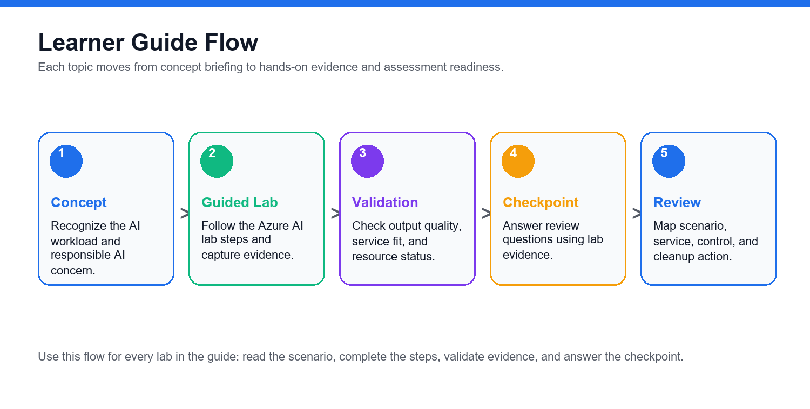

## Learning Outcomes

- Identify common AI workloads and use cases.
- Explain responsible AI principles and human review needs.
- Distinguish regression, classification, clustering, deep learning, and transformer-based workloads.
- Describe Azure Machine Learning and automated ML concepts.
- Map vision, NLP, speech, translation, document, and generative AI scenarios to Azure services.
- Recognize security, privacy, governance, and cost controls for AI solutions.

## Skills Framework Alignment

**TSC Title:** Artificial Intelligence Application  
**TSC Code:** ICT-DIT-4016-1.1

| Knowledge / Ability | Lab Alignment |
| --- | --- |
| AI workload recognition and responsible AI | Labs 01, 09, 10 |
| Machine learning concepts and Azure Machine Learning | Labs 02, 03 |
| Vision, language, speech, and document AI services | Labs 04, 05, 06, 07 |
| Generative AI, Azure AI Foundry, Azure OpenAI, and model catalog concepts | Lab 08 |
| Governance, security, privacy, cost, and cleanup controls | Labs 09, 10 |

## Azure AI Service Map

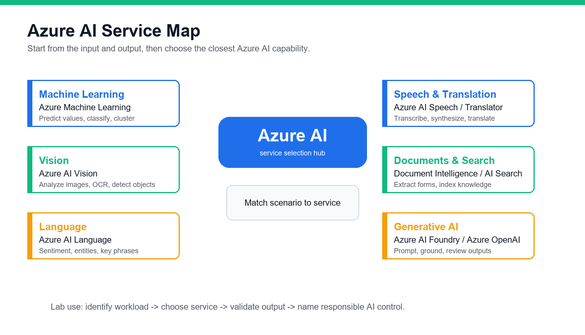

## Lab Environment Setup

1. Open https://portal.azure.com/.
2. Sign in with an instructor-provided or personal Azure account.
3. Confirm subscription and resource group access.
4. Use free tiers where possible.
5. Do not paste personal or confidential data into AI demos.
6. Clean up resources when the trainer confirms it is safe.

## Labs

## Lab 01 - AI Workloads and Responsible AI

## Objectives

- Identify common AI workloads.
- Match workloads to business scenarios.
- Explain responsible AI principles.
- Create a responsible AI checklist.

## Scenario

A retail company wants to use AI for product recommendations, customer support, document processing, image analysis, and marketing content generation. You must identify the workload types and responsible AI concerns.

## Steps

### 1. Identify AI Workloads

Create a table:

| Scenario | AI Workload |
| --- | --- |
| Detect damaged products in photos | Computer vision |
| Extract invoice totals | Document processing |
| Classify customer feedback sentiment | Natural language processing |
| Generate campaign copy | Generative AI |
| Predict future sales | Machine learning |

Add at least five more examples.

### 2. Map Workloads to Azure Services

Use this starting map:

| Workload | Azure Service |
| --- | --- |
| Image analysis | Azure AI Vision |
| Text analytics | Azure AI Language |
| Speech to text | Azure AI Speech |
| Document extraction | Azure AI Document Intelligence |
| Generative AI | Azure AI Foundry or Azure OpenAI |
| Custom ML | Azure Machine Learning |

### 3. Review Responsible AI Principles

Write a one-sentence explanation for:

```text
Fairness
Reliability and safety
Privacy and security
Inclusiveness
Transparency
Accountability
```

### 4. Build a Responsible AI Checklist

For the retail use case, answer:

1. Who could be harmed by poor predictions?
2. What data is sensitive?
3. How will users know AI is involved?
4. Who approves the AI solution?
5. How are errors reported and corrected?

## Validation

You should have workload examples, Azure service mapping, and a responsible AI checklist.

## Checkpoint Questions

1. What is a computer vision workload?
2. Why is fairness important?
3. What is transparency in AI?
4. Who is accountable for an AI system?

## Exam Focus

AI-900-style questions often ask you to identify workload types and responsible AI principles from a scenario.

### Lab Workflow Diagram

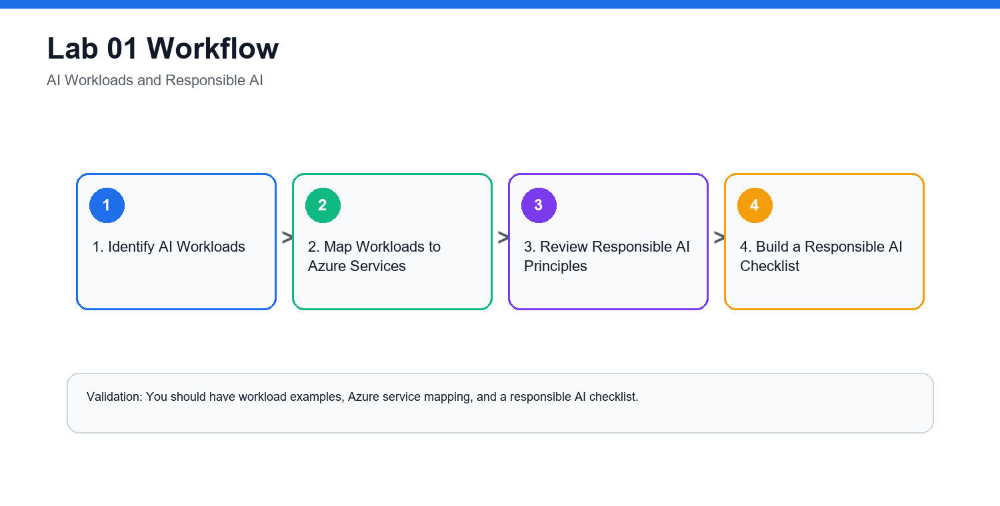


## Lab 02 - Machine Learning Fundamentals

## Objectives

- Distinguish regression, classification, and clustering.
- Explain features, labels, training data, and validation data.
- Understand deep learning and transformer concepts.
- Match ML techniques to scenarios.

## Scenario

The retail company wants to use historical data to predict outcomes. You must decide which machine learning technique fits each business question.

## Steps

### 1. Classify ML Scenarios

Create a table:

| Business Question | ML Technique |
| --- | --- |
| What will next month's sales be? | Regression |
| Will this customer churn? | Classification |
| Which customers behave similarly? | Clustering |
| Is this image a product or receipt? | Deep learning |

### 2. Identify Features and Labels

For a churn prediction dataset, identify:

```text
Features: customer age, tenure, purchase count, support tickets
Label: churned or not churned
```

Create two more examples.

### 3. Explain Training and Validation

Write:

1. Why data is split into training and validation sets.
2. What overfitting means.
3. Why evaluation metrics matter.

### 4. Review Deep Learning and Transformers

In your notes, explain:

- Deep learning uses neural networks with multiple layers.
- Transformers are useful for language and generative AI workloads.
- Foundation models can be adapted for many tasks.

### 5. Match Technique to Service

| Need | Possible Azure Service |
| --- | --- |
| No-code ML model | Azure Machine Learning automated ML |
| Custom ML workflow | Azure Machine Learning |
| Generative text | Azure AI Foundry or Azure OpenAI |
| Image analysis without custom training | Azure AI Vision |

## Validation

You should have scenario mappings, feature/label examples, and a training/validation explanation.

## Checkpoint Questions

1. What is regression used for?
2. What is classification used for?
3. What is clustering used for?
4. What is the difference between a feature and a label?

## Exam Focus

Know how to select the basic ML technique from the wording of a business scenario.

### Lab Workflow Diagram

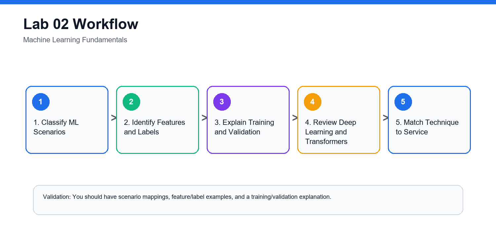


## Lab 03 - Azure Machine Learning, Automated ML, Model Lifecycle

## Objectives

- Describe Azure Machine Learning capabilities.
- Explain automated machine learning.
- Understand data, compute, jobs, models, and endpoints.
- Map the model lifecycle.

## Scenario

The retail company wants to build a custom churn model but does not yet have a large data science team. You must explain how Azure Machine Learning can support the workflow.

## Steps

### 1. Open Azure Machine Learning Studio

1. Open the Azure portal.
2. Search for `Azure Machine Learning`.
3. Open or create a training workspace if your instructor provides access.
4. Open Azure Machine Learning studio.

### 2. Identify Core Workspace Areas

Find and record:

```text
Data
Notebooks
Compute
Jobs
Models
Endpoints
Automated ML
```

### 3. Explain Automated ML

Write how AutoML helps with:

- Trying multiple algorithms.
- Selecting features.
- Evaluating models.
- Ranking model candidates.
- Producing a model for deployment review.

### 4. Map the Model Lifecycle

Create a flow:

```text
Collect data
Prepare data
Train model
Evaluate model
Register model
Deploy model
Monitor model
Retrain when needed
```

### 5. Choose Compute Safely

Discuss why training compute should match the lab size, budget, and workload.

## Validation

You should have a workspace area map, AutoML explanation, and model lifecycle flow.

## Cleanup

Delete any Azure Machine Learning workspace or compute resources created only for class if instructed.

## Checkpoint Questions

1. What is automated machine learning?
2. What is a model endpoint?
3. Why is model monitoring needed?
4. Why does compute choice affect cost?

## Exam Focus

Understand what Azure Machine Learning does at a high level: data, compute, training, automated ML, model management, deployment, and monitoring.

### Lab Workflow Diagram

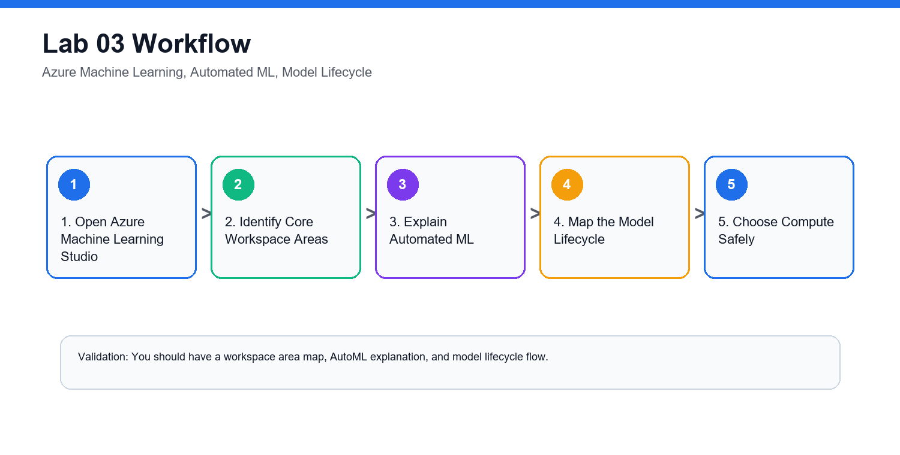


## Lab 04 - Computer Vision, Image Analysis, OCR

## Objectives

- Identify computer vision workloads.
- Distinguish image classification, object detection, OCR, and face detection.
- Describe Azure AI Vision capabilities.
- Review responsible AI concerns for vision.

## Scenario

The retail company wants to analyze product photos, detect damaged items, read shelf labels, and blur faces in store images.

## Steps

### 1. Match Vision Scenarios

| Scenario | Vision Workload |
| --- | --- |
| Identify product category in an image | Image classification |
| Locate multiple products in a photo | Object detection |
| Read text from a receipt | Optical character recognition |
| Detect whether a face appears | Face detection |

### 2. Explore Azure AI Vision Concepts

In the Azure portal or Microsoft Learn documentation, review:

```text
Image analysis
OCR
Object detection
Image tagging
Caption generation
Face detection
```

### 3. Design a Vision Solution

For damaged product detection, document:

1. Input image source.
2. Expected output.
3. Azure service.
4. Human review requirement.
5. Responsible AI risk.

### 4. Responsible AI Review

Answer:

- Could image data contain people?
- Is consent required?
- Should images be retained?
- Could lighting or camera angle affect accuracy?
- How should users appeal incorrect results?

## Validation

You should have a scenario mapping table, Azure AI Vision capability notes, and responsible AI review.

## Checkpoint Questions

1. What is OCR?
2. How is object detection different from image classification?
3. Why is face analysis sensitive?
4. Which Azure service supports common vision workloads?

## Exam Focus

Vision questions often ask which workload or Azure service fits the scenario.

### Lab Workflow Diagram

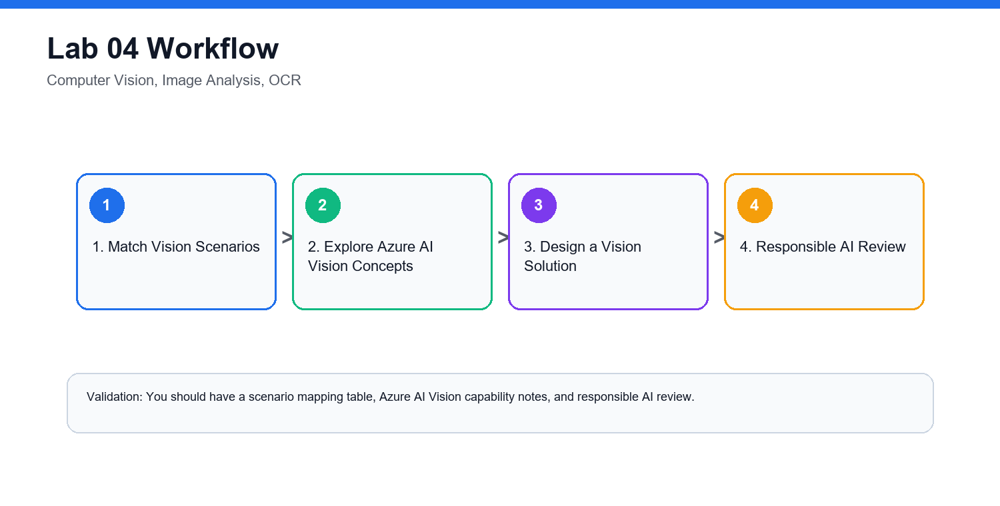


## Lab 05 - Natural Language Processing and Azure AI Language

## Objectives

- Identify NLP workloads.
- Explain sentiment analysis, key phrase extraction, entity recognition, and language modeling.
- Describe Azure AI Language capabilities.
- Review responsible AI concerns for text processing.

## Scenario

The retail company receives thousands of customer comments. It wants to detect sentiment, extract key topics, identify product names, and route complaints.

## Steps

### 1. Map NLP Workloads

| Scenario | NLP Workload |
| --- | --- |
| Is feedback positive or negative? | Sentiment analysis |
| What topics are mentioned? | Key phrase extraction |
| Which products or locations are named? | Entity recognition |
| What language is this text written in? | Language detection |
| What does this customer want? | Intent recognition or classification |

### 2. Review Azure AI Language

Document capabilities such as:

```text
Sentiment analysis
Key phrase extraction
Named entity recognition
Language detection
Text classification
Question answering
Summarization concepts
```

### 3. Design a Feedback Pipeline

Create a flow:

```text
Collect feedback
Detect language
Translate if needed
Analyze sentiment
Extract key phrases
Identify entities
Route high-risk complaints
Store dashboard results
```

### 4. Responsible AI Review

Answer:

1. Could customer comments contain personal data?
2. Could sentiment analysis misunderstand sarcasm?
3. Should automated routing be reviewed by humans?
4. How should low-confidence results be handled?

## Validation

You should have NLP workload mapping, Azure AI Language notes, and a feedback pipeline design.

## Checkpoint Questions

1. What is sentiment analysis?
2. What is entity recognition?
3. What is key phrase extraction?
4. Why can NLP results require human review?

## Exam Focus

NLP questions often describe text, speech, translation, sentiment, or entity extraction scenarios.

### Lab Workflow Diagram

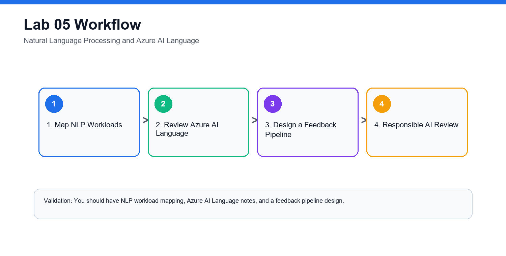


## Lab 06 - Speech, Translation, Conversational AI

## Objectives

- Describe speech recognition and synthesis.
- Explain translation workloads.
- Recognize conversational AI use cases.
- Map scenarios to Azure AI Speech, Translator, and Bot-related services.

## Scenario

The retail company wants a multilingual customer support experience with voice input, translated text, and a chatbot for common questions.

## Steps

### 1. Match Speech and Translation Scenarios

| Scenario | Workload |
| --- | --- |
| Convert customer voice to text | Speech recognition |
| Read a response aloud | Speech synthesis |
| Translate English to Malay | Translation |
| Detect spoken language | Speech or language detection |
| Answer FAQ through chat | Conversational AI |

### 2. Review Azure Services

Document:

```text
Azure AI Speech
Azure AI Translator
Azure Bot Service concepts
Azure AI Language for question answering
```

### 3. Design a Support Assistant

Create a flow:

```text
Customer speaks
Speech to text
Language detection
Translation if required
Question answering or intent detection
Response generation
Text to speech
Escalate to human agent if needed
```

### 4. Responsible AI Review

Answer:

- What happens if speech recognition is wrong?
- How are accents and background noise handled?
- When should a human agent take over?
- Should users be told they are interacting with a bot?

## Validation

You should have scenario mappings, Azure service notes, support assistant flow, and responsible AI review.

## Checkpoint Questions

1. What is speech recognition?
2. What is speech synthesis?
3. What is translation used for?
4. Why is human escalation important in conversational AI?

## Exam Focus

Speech and translation questions usually test whether you can identify the workload and the right Azure AI service.

### Lab Workflow Diagram

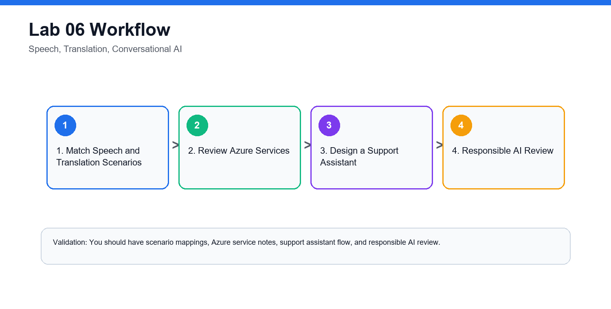


## Lab 07 - Document Intelligence and Knowledge Mining

## Objectives

- Identify document processing workloads.
- Explain form extraction and OCR.
- Describe Azure AI Document Intelligence.
- Explain knowledge mining concepts.

## Scenario

The retail company processes invoices, receipts, and supplier forms manually. It wants to extract structured information and make documents searchable.

## Steps

### 1. Identify Document Tasks

| Document Task | Workload |
| --- | --- |
| Read printed text | OCR |
| Extract invoice number and amount | Form extraction |
| Extract tables | Document intelligence |
| Search across scanned files | Knowledge mining |
| Classify document type | Classification |

### 2. Review Azure AI Document Intelligence

Document:

```text
Prebuilt models
Custom extraction
Layout extraction
Tables
Key-value pairs
Confidence scores
```

### 3. Design an Invoice Processing Flow

```text
Upload invoice
Run document extraction
Validate confidence score
Human review if low confidence
Store structured fields
Search and report
Archive according to policy
```

### 4. Review Knowledge Mining

Explain how AI enrichment, indexing, and search can make unstructured documents discoverable.

### 5. Responsible AI Review

Answer:

- Do documents contain personal data?
- What confidence threshold triggers human review?
- Who can access extracted data?
- How long are documents retained?

## Validation

You should have a document task map, extraction flow, knowledge mining notes, and responsible AI review.

## Checkpoint Questions

1. What is document processing?
2. How is OCR related to document intelligence?
3. Why are confidence scores useful?
4. What is knowledge mining?

## Exam Focus

Document processing questions may reference OCR, forms, invoices, extraction, and search.

### Lab Workflow Diagram

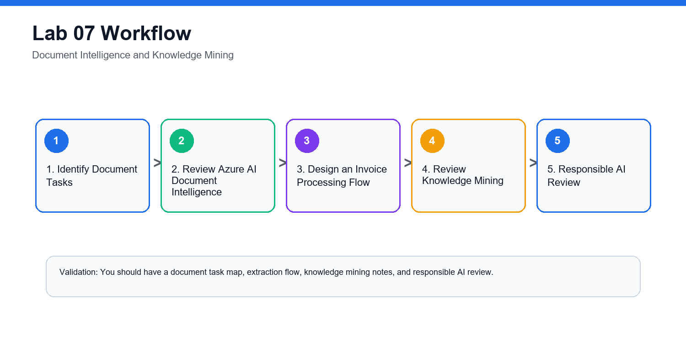


## Lab 08 - Generative AI, Azure AI Foundry, Azure OpenAI, Model Catalog

## Objectives

- Explain generative AI concepts.
- Identify common generative AI scenarios.
- Describe Azure AI Foundry, Azure OpenAI, and model catalog capabilities.
- Apply responsible AI considerations for generative AI.

## Scenario

The retail company wants to use generative AI to draft product descriptions, summarize customer reviews, and help support agents respond faster.

## Steps

### 1. Define Generative AI Terms

Create glossary entries:

```text
Generative AI
Prompt
Completion
Foundation model
Large language model
Transformer
Grounding
Retrieval augmented generation
Content filter
```

### 2. Match Generative AI Scenarios

| Scenario | Generative AI Use |
| --- | --- |
| Draft product description | Text generation |
| Summarize reviews | Summarization |
| Answer questions from policy docs | Grounded question answering |
| Create support response draft | Agent assistance |
| Generate image concepts | Image generation |

### 3. Review Azure Capabilities

Document:

```text
Azure AI Foundry
Azure OpenAI service
Model catalog
Prompt flow concepts
Content safety
Evaluation
```

### 4. Responsible AI Review

Answer:

1. Could the model produce inaccurate content?
2. Does output need human review?
3. What data should not be sent to the model?
4. How are harmful outputs filtered?
5. How will users know content is AI-assisted?

### 5. Design a Safe Assistant

Create a short design:

```text
Use case:
Data source:
Model:
Grounding approach:
Human review:
Monitoring:
Safety controls:
```

## Validation

You should have a generative AI glossary, scenario map, Azure capability notes, and safe assistant design.

## Checkpoint Questions

1. What is generative AI?
2. What is a prompt?
3. What is grounding?
4. Why is responsible AI especially important for generative AI?

## Exam Focus

Current AI fundamentals material emphasizes generative AI, Azure AI Foundry, Azure OpenAI, and model catalog concepts.

### Lab Workflow Diagram

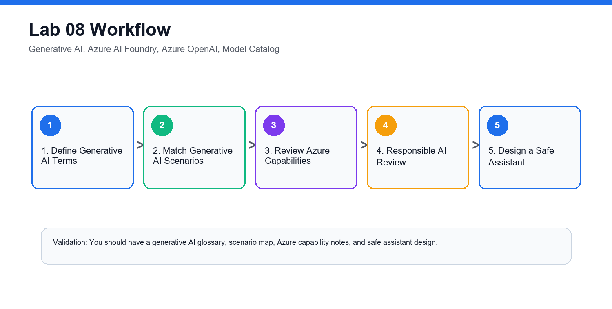


## Lab 09 - AI Solution Design, Security, Cost, Governance

## Objectives

- Design a simple Azure AI solution.
- Identify security, privacy, and governance controls.
- Review cost considerations.
- Choose appropriate Azure AI services.

## Scenario

The retail company wants one AI solution that analyzes customer feedback, summarizes themes, and routes urgent complaints. You must recommend services and controls.

## Steps

### 1. Confirm Requirements

Write:

```text
Business goal:
Input data:
Expected output:
Users:
Latency need:
Privacy constraints:
Human review requirement:
```

### 2. Choose Services

| Requirement | Azure Service |
| --- | --- |
| Sentiment and entities | Azure AI Language |
| Translation | Azure AI Translator |
| Summarization or response drafting | Azure AI Foundry or Azure OpenAI |
| Custom ML prediction | Azure Machine Learning |
| Secure storage | Azure Storage with access control |

### 3. Add Security Controls

Document:

- Role-based access control.
- Managed identities.
- Private data handling.
- Logging and monitoring.
- Key and endpoint protection.
- Human review for high-risk actions.

### 4. Review Cost Controls

Answer:

1. Which services are billed per transaction or token?
2. How will usage be monitored?
3. What budget alert is needed?
4. How will unused resources be deleted?

### 5. Add Responsible AI Controls

Include:

- Transparency message.
- Error reporting channel.
- Human review workflow.
- Bias and fairness review.
- Privacy review.

## Validation

You should have a requirements summary, service selection table, security controls, cost controls, and responsible AI controls.

## Checkpoint Questions

1. Why does AI solution design include governance?
2. What is RBAC used for?
3. Why are budget alerts useful?
4. Why is human review important for high-impact outputs?

## Exam Focus

AI solution questions often test choosing the right service and recognizing responsible AI, privacy, and security concerns.

### Lab Workflow Diagram

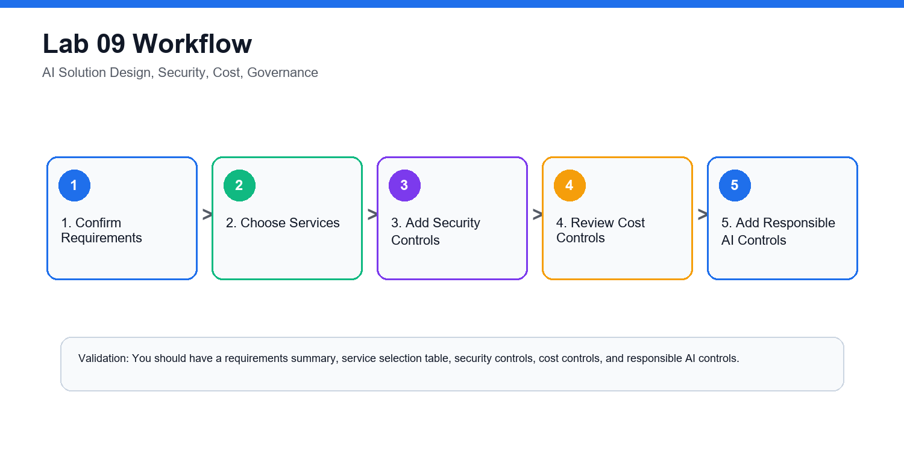


## Lab 10 - AI-900 Capstone and Course Review

## Objectives

- Review all Azure AI fundamentals topics.
- Build an end-to-end AI service map.
- Practice workload recognition.
- Create a personal review plan.
- Clean up lab resources.

## Scenario

You must brief a manager on which Azure AI services could support the retail company and what risks must be managed.

## Steps

### 1. Build a Service Map

Create a table:

| Business Need | AI Workload | Azure Service |
| --- | --- | --- |
| Analyze product photos | Computer vision | Azure AI Vision |
| Extract invoice fields | Document processing | Azure AI Document Intelligence |
| Understand customer comments | NLP | Azure AI Language |
| Convert calls to text | Speech recognition | Azure AI Speech |
| Draft response suggestions | Generative AI | Azure AI Foundry or Azure OpenAI |
| Train custom prediction model | Machine learning | Azure Machine Learning |

### 2. Review Responsible AI

For each principle, write one action:

```text
Fairness:
Reliability and safety:
Privacy and security:
Inclusiveness:
Transparency:
Accountability:
```

### 3. Review ML Techniques

Match:

| Technique | Scenario |
| --- | --- |
| Regression | Predict numeric value |
| Classification | Predict category |
| Clustering | Group similar items |
| Deep learning | Complex image, speech, or language tasks |
| Transformer | Language and generative AI workloads |

### 4. Build a Review Log

Record weak areas:

```text
Topic:
Why it is confusing:
Definition to memorize:
Example scenario:
```

### 5. Clean Up Resources

If resources were created:

```bash
az group delete --name rg-ai900-lab --yes --no-wait
```

Confirm with your instructor before deleting shared resources.

### 6. Prepare a 7-Day Study Plan

1. Day 1: AI workloads and responsible AI.
2. Day 2: Machine learning fundamentals.
3. Day 3: Azure Machine Learning.
4. Day 4: Computer vision and document intelligence.
5. Day 5: NLP, speech, and translation.
6. Day 6: Generative AI, Foundry, Azure OpenAI.
7. Day 7: Scenario practice and review log.

## Validation

You should have a service map, responsible AI action list, ML technique table, review log, and cleanup confirmation.

## Checkpoint Questions

1. Which AI workload is easiest for you to identify?
2. Which Azure service names are most confusing?
3. What is the difference between traditional ML and generative AI?
4. What responsible AI principle do you need to review most?

## Course Focus

The goal is to recognize AI workloads, understand foundational concepts, and describe how Azure AI services support common business scenarios.

### Lab Workflow Diagram

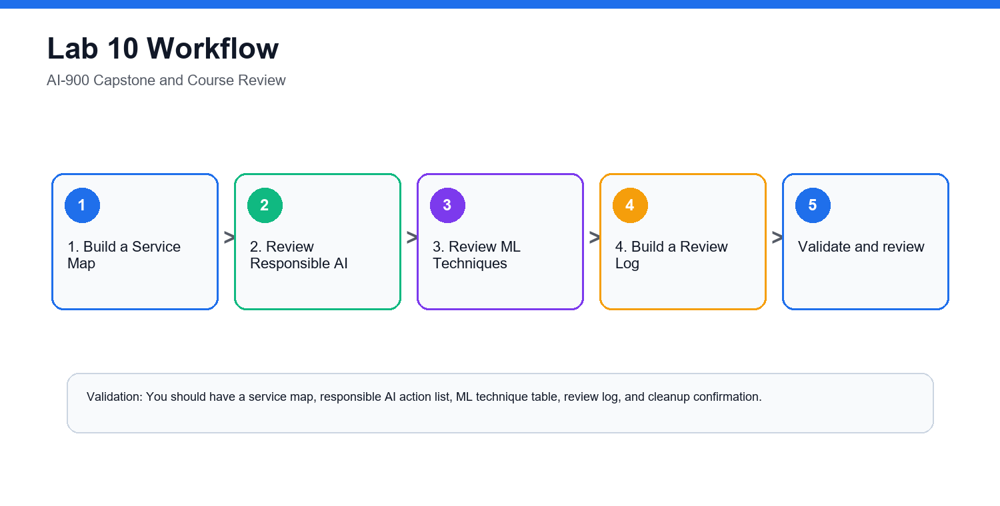


## Final Review Checklist

- Match AI workloads to Azure services.
- Explain responsible AI principles.
- Distinguish machine learning techniques.
- Recognize vision, language, speech, document, and generative AI scenarios.
- Identify security, privacy, cost, and governance considerations.
